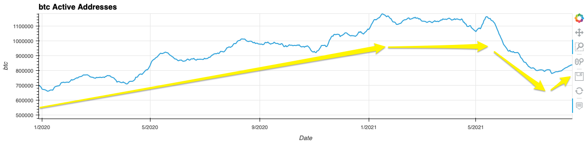
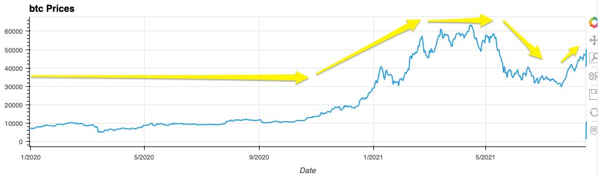

# Fintech Bootcamp Project 1: Cryptocurrency Fundamental Analysis Tool

## **Group 5:**

Aquiba Benarroch 
Moustafa Moussa 
Donna Salinas 

## **Project Overview:**

As new investors learn more about the world of cryptocurrency, oftentimes than not, it can be an information overload when it comes to selecting a coin to invest in. The goal is to create a user-friendly tool that helps investors make an educated decision on which of the selected 4 coins is a better investment based on fundamental data. For this project, we’ve selected the following four coins: BTC, ETH, DOGE and USDT. Using data taken from CoinMetrics, we have set up pandas DataFrames to display each coin’s fundamental information. Alongside this information, there are interactive plots made with hvplot and panel-holoviz to visually display a coin’s historical changes over time for the provided fundamentals. 

## **Research Questions:**

During the early planning stages, we came up with the following questions to build and set an overall foundation for the project. Taking inspiration from price-tracking websites for cryptoassests such as CoinMarketCap, we chose certain coin fundamentals and plots suitable for beginners starting out in cryptocurrency. 

1. How often should the coin data be refreshed?
2. How coin fundamentals have changed over time (market cap, volume or supply, etc.)? 
3. Should we display a coin’s realistic market cap numbers as well? How detailed will this project be? How will it be organized? 
4. Is it useful to show a coin’s market cap rank, liquidity score, and all time highs/lows? 
5. Can fundamental analysis help investors make better investment decisions?

## **Data Collection:**

We will be using CoinMetrics APIs to fetch the information for supply for this project. Coin Metrics organizes the world's crypto data and makes it transparent and accessible. 
The data points we will highlight include: market cap, active addresses, and other relevant information. We will set up the Jupyter Notebook to look like a dashboard and will use pandas for data frames to display the information provided by the API. 

**Libraries Utilized:**

- Pandas - Python library and data cleaning
- NumPy - Calculations
- hvPlot - Visual graphics
- Panel - Interactive web apps and widgets
- HoloViews - Data analysis and visualization cleanup

***Image 1: Generalized Overview of the Cryptocurrency Fundamental Analysis Tool***

The Cryptocurrency Fundamental Analysis Tool works overall is like the following:

The tool takes in the following inputs: the API url, timeframe, and the selected coins.Next, the API creates the connection between CoinMetrics and JupyterLab. The API responds to the following code/functions within JupyterLab and outputs our data via JSON format which has been organized by using panda Dataframes. Once we get our metric outputs, there are interactive plots made with hvPlot and Panel-holoviz to visually display a coin’s historical changes over time.

**Choosing certain asset metrics from CoinMetrics’ API:**

When it came to organizing the content of our tool, we picked certain metrics that would be most appropriate for the beginner crypto investor. For this tool the following asset metrics (alongside their assigned IDs) were selected: 

- Prices: ReferenceRate
- Active Addresses: AdrActCnt
- Free Float Supply: SplyFF
- Transaction Count: TxCnt
- Market Cap Total: CapMrktCurUSD
- Market Cap Real: CapRealUSD
- MK Value Percent: CapMVRVCur
- Addresses $1: AdrBalUSD1Cnt
- Addresses $1M: AdrBalUSD1MCnt

***Image 2: CoinMetrics Asset Metrics Concatencated DataFrames to Comply with DRY Standard***

By choosing basic information such as a coin’s price, market cap and its active addresses is essential for our tool. Additional features such as the ones listed above can be added to our tool with additional programming based on what the API offers. CoinMetrics has a query that lists a metrics' assests and attritbutes which are represented by an specfic asset ID. This gives it a specfic function and describes how frequent these metrics are updated and categorized. 

These metrics were accessed from this website: https://docs.coinmetrics.io/info/metrics

## **Interactive Visual Graph:**

Write a description of  how it was made using a dynamic plot with its price information
Paste images of the actual plots and features

***Image 3: Panel library within the Function***

***Image 4: Interactive Tool and Graph***

## **Using the Tool for Graph Comparisons for Cryptocurrencies (BTC, ETH, DOGE, USDT):**

**Bitcoin (BTC):**

With a total supply of 21 million coins, Bitcoin (as of August 2021), is the highest valued coin with 18 million coins currently circulating. With 18 million coins multiplied by its current price ($45K: August 11, 2021) puts Bitcoins’ market cap over a trillion dollars. 

***Image 5: BTC Active Addresses***

***Image 6: BTC Prices***

*Changes in ‘active addresses’ as a leading indicator of BTC price*

**Etheruem (ETH):**

*Introduction*

*Historic changes of key fundamentals metrics*

*Changes in ‘active addresses’ as a leading indicator of ETH price*

**Doge (DOGE):**

*Introduction*

*Historic changes of key fundamentals metrics*

*Changes in ‘active addresses’ as a leading indicator of DOGE price*

**Tether (USDT):**

*Introduction* 

*Historic changes of key fundamentals metrics*

*Changes in ‘active addresses’ as a leading indicator of USDT price*

## **Case Study**

Effect of EIP-1559 adoption to the supply of ethereum

## **Conclusion:**

- Reintroduce our tool again
- Briefly mention how we collected data and made our tool
-- Using CoinMetrics API to supply the real-time coin data, we will also create historical graphs of the coins as they change over time.
- The features the tool has and how it’s helpful for an investor interested in cryptocurrency 

