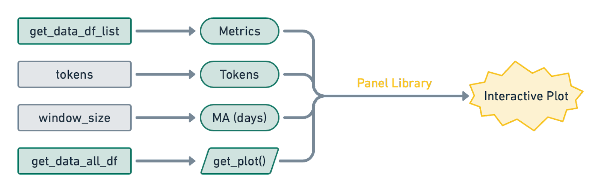
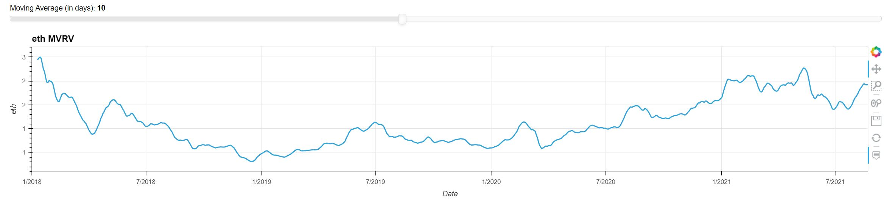

# Fintech Bootcamp Project 1: Cryptocurrency Fundamental Analysis Tool

## **Group 5:**

Aquiba Benarroch 
Moustafa Moussa 
Donna Salinas 

## **Project Overview:**

As new investors learn more about the world of cryptocurrency, oftentimes than not, it can be an information overload when it comes to selecting a coin to invest in. The goal is to create a user-friendly tool that helps investors make an educated decision on which of the selected 4 coins is a better investment based on fundamental data. For this project, we’ve selected the following four coins: BTC, ETH, DOGE and USDT. Using data taken from CoinMetrics, we have set up pandas DataFrames to display each coin’s fundamental information. Alongside this information, there are interactive plots made with hvplot and panel-holoviz to visually display a coin’s historical changes over time for the provided fundamentals. 

## **Research Questions:**

During the early planning stages, we came up with the following questions to build and set an overall foundation for the project. Taking inspiration from price-tracking websites for cryptoassests such as CoinMarketCap, we chose certain coin fundamentals and plots suitable for beginners starting out in cryptocurrency. 

1. How often should the coin data be refreshed?
2. How coin fundamentals have changed over time (market cap, volume or supply, etc.)? 
3. Should we display a coin’s realistic market cap numbers as well? How detailed will this project be? How will it be organized? 
4. Is it useful to show a coin’s market cap rank, liquidity score, and all time highs/lows? 
5. Can fundamental analysis help investors make better investment decisions?

## **Data Collection:**

We will be using CoinMetrics APIs to fetch the information for supply for this project. Coin Metrics organizes the world's crypto data and makes it transparent and accessible. 
The data points we will highlight include: market cap, active addresses, and other relevant information. We will set up the Jupyter Notebook to look like a dashboard and will use pandas for data frames to display the information provided by the API. 

**Libraries Utilized:**

- Pandas - Python library and data cleaning
- NumPy - Calculations
- hvPlot - Visual graphics
- Panel - Interactive web apps and widgets
- HoloViews - Data analysis and visualization cleanup

***Image 1: Generalized Overview of the Cryptocurrency Fundamental Analysis Tool***

The Cryptocurrency Fundamental Analysis Tool works overall is like the following:

The tool takes in the following inputs: the API url, timeframe, and the selected coins.Next, the API creates the connection between CoinMetrics and JupyterLab. The API responds to the following code/functions within JupyterLab and outputs our data via JSON format which has been organized by using panda Dataframes. Once we get our metric outputs, there are interactive plots made with hvPlot and Panel-holoviz to visually display a coin’s historical changes over time.

**Connecting the API to the pandas DataFrames**

Our first function is the get_data function. The function pulls data from the API and creates the DataFrames which creates data lists for the relevant items presented in the tool (time, symbol, token, value). Through a 'for loop', it gets the relevant URL from the API which takes in the five inputs shown below in image 2. This generates a JSON response and our tool goes into another 'for loop' to append the information to a list which is displayed in a Dataframe.

***Image 2: get_data() Function***

**Choosing certain asset metrics from CoinMetrics’ API:**

When it came to organizing the content of our tool, we picked certain metrics that would be most appropriate for the beginner crypto investor. For this tool the following asset metrics (alongside their assigned IDs) were selected: 

- Prices: ReferenceRate
- Active Addresses: AdrActCnt
- Free Float Supply: SplyFF
- Transaction Count: TxCnt
- Market Cap Total: CapMrktCurUSD
- Market Cap Real: CapRealUSD
- MK Value Percent: CapMVRVCur
- Addresses $1: AdrBalUSD1Cnt
- Addresses $1M: AdrBalUSD1MCnt

***Image 3: CoinMetrics Asset Metrics Concatencated DataFrames to Comply with DRY Standard***

By choosing basic information such as a coin’s price, market cap and its active addresses is essential for our tool. Additional features such as the ones listed above can be added to our tool with additional programming based on what the API offers. CoinMetrics has a query that lists a metrics' assests and attritbutes which are represented by an specfic asset ID. This gives it a specfic function and describes how frequent these metrics are updated and categorized. To comply with the DRY standard, we created a single DataFrame get_data_all_df (as multiple DataFrames had a diffcult time connecting to the plotting functions to create a unified hvPlot line) and added a 'Label' column for each metric and concatencated them with pd.concat.

These metrics were accessed from this website: https://docs.coinmetrics.io/info/metrics

## **Interactive Visual Graph:**

**Transforming DataFrame into hvPlot**

With the final DataFrame get_data_all_df, our tool was able transfer this data to our get_plot function. Our tool transforms this DataFrame into a uniform hvPlot lines. The get_plot function works by including three variables (metric_df, token, window_size) to supply to the interactive widgets. The inputs are sourced from the get_data_all_df which gets filtered by the token and the 'Label'. The reason for this is because in the plot we can choose the widget and choose which metric we want to focus on. We edit the DataFrame again to get the window_size that we select and we create the hvplot.line for the DataFrame.

***Image 4: get_plot() Function***

**Combining hvPlot with the Panel library to get Visual and Interactive Graphs**

Combining the final DataFrame get_data_all_df and the get_plot function, using the panel library, we are able to get the interactive plots with their interactive widgets (metrics, tokens, moving average in days).

***Image 5: Panel library within the get_plot() Function***

***Image 6: Interactive Tool and Graph***

## **Using the Tool for Graph Comparisons for Cryptocurrencies (BTC, ETH, DOGE, USDT):**

**Bitcoin (BTC):**

With a total supply of 21 million coins, Bitcoin (as of August 2021), is the highest valued coin with 18 million coins currently circulating. With 18 million coins multiplied by its current price ($45K: August 11, 2021) puts Bitcoins’ market cap over a trillion dollars. 

A new investor could use our tool and say may notice certain patterns with our graphs. Such as perhaps changes in ‘active addresses’ as a leading indicator of BTC price. The movement of active addresses seems to be ahead of how BTC prices will move in upcoming weeks/months. 

***Image 7: BTC Prices and BTC Active Addresses***

**Ether (ETH):**

Etheruem is a decentralized application (DApps), that is an open-source blockchain with smart contract functionality. Its coin the Ether has continued to increase over time as new blockchain projects feed in the Etheruem network building out their platform. As a decentralized finance application, Etheruem provides a wide range of financial services without the need of a brokeages, exchanges, or banks. It also provides investors the opportunity to create and exchange NFTs. 

***Image 8: ETH Prices and ETH MVRV***

**DogeCoin (DOGE):**

Starting out as a parody less than a decade ago, the Dogecoin cryptocurrency has sky rocketed in 2021 as new investors piled in. At the start of the year, DOGE traded at $0.005405 and its current price as of August 19th is $0.3207. At it highest peak, Dogecoin gained more than 15,000%.

***Image 9: DOGE Prices and DOGE Addresses > $1***

**Tether (USDT):**

Tether is a cryptocurrency labeled as a 'stablecoin' as it was originally designed to be worth $1.00. This digital coin is tied to real-world assets such as the US dollar to maintain its stable value. As of July 2021, it is the third-biggest cryptocurrency in the world based on its market value. 

***Image 10: USDT Prices and USDT Active Addresses***

## **Case Study using the Free Float Metric**

Effect of EIP-1559 adoption to the supply of Ethereum. One of the key changes to the protocal was that instead of mining ETH and creating more supply for ETH everytime there is a new block in the chain, they will start burning ETH. With our tool, we wanted to test if we could see this happen in real time for ETH and choose the free float metric to see this. As we can see in the following images below, we can see ETH start to decrease. Especially on August 4th when this change was announced. 

***Image 11: Changes to ETH Prices and Free Float Supply as the Effect of EIP-1559 adoption***

## **Conclusion:**

- Reintroduce our tool again. Briefly mention how we collected data and made our tool. Using CoinMetrics API to supply the real-time coin data, we will also create historical graphs of the coins as they change over time. The features the tool has and how it’s helpful for an investor interested in cryptocurrency 
